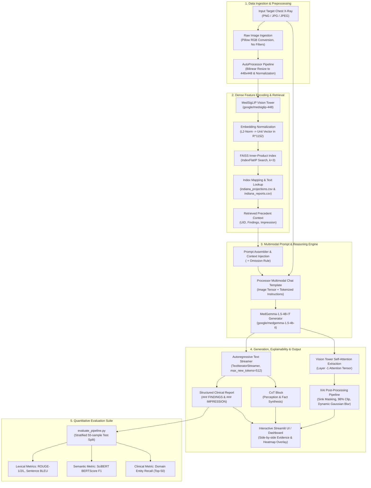
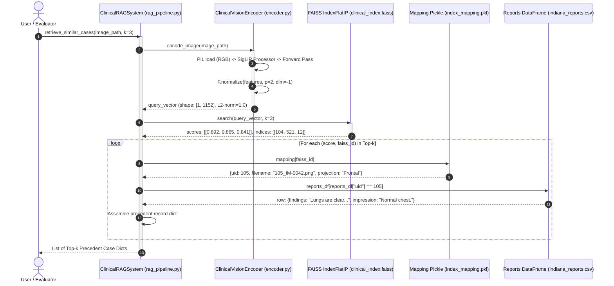

# CLIN-RAG: Clinical Evidence Retrieval and Grounded Report Generation
## Technical System Documentation & Architecture Reference

This document provides a comprehensive, deeply technical, and mathematically exact documentation of the **CLIN-RAG** codebase. It is designed to serve as the definitive factual reference for academic publications and thesis preparation in IEEE format. Every workflow, parameter, class, function, tensor dimension, and design constraint described herein is verified directly against the underlying Python source code, YAML configuration, and evaluation modules.

---

## Table of Contents
1. [System Architecture & Workflow](#1-system-architecture--workflow)
2. [Data Pipeline & Preprocessing](#2-data-pipeline--preprocessing)
3. [Vision Encoding (MedSigLIP)](#3-vision-encoding-medsiglip)
4. [Vector Retrieval (FAISS)](#4-vector-retrieval-faiss)
5. [Multimodal Generation & Clinical CoT (MedGemma)](#5-multimodal-generation--clinical-cot-medgemma)
6. [Evaluation Suite & Metrics](#6-evaluation-suite--metrics)
7. [Configuration & Hyperparameter Specification](#7-configuration--hyperparameter-specification)

---

# 1. System Architecture & Workflow

CLIN-RAG is a multimodal, precedence-driven Retrieval-Augmented Generation (RAG) framework engineered to generate grounded, structured chest radiograph (CXR) reports. The system is designed to minimize visual and diagnostic hallucinations by conditioning a multimodal foundation Large Language Model (LLM) on structurally similar precedent cases retrieved from an indexed clinical knowledge database.

### End-to-End Pipeline Overview
1. **Target Image Acquisition**: An unseen target radiograph ($I_{\text{target}}$) is supplied in standard image format (PNG, JPG).
2. **Deterministic Non-Destructive Preprocessing**: The raw pixel matrix is loaded via Pillow without any image-filtering or smoothing operations, then resized deterministically to $448 \times 448$ pixels and normalized according to SigLIP channel-wise statistics.
3. **Dense Vision Encoding**: The vision backbone (`google/medsiglip-448`) computes a $D$-dimensional representation ($D = 1152$). The feature vector is explicitly normalized to unit length on the $L_2$ hypersphere ($S^{D-1}$).
4. **Vector Retrieval**: The normalized query vector $q \in \mathbb{R}^{1152}$ searches a FAISS Inner-Product (`IndexFlatIP`) vector database containing $N$ historical case embeddings. The top-$k$ nearest neighbors (default $k=3$) are fetched according to cosine similarity.
5. **Metadata & Precedent Case Resolution**: Integer FAISS vector indices are resolved back to patient records (`indiana_projections.csv` and `indiana_reports.csv`) to extract past ground-truth clinical texts (`findings` and `impression`).
6. **Prompt Construction with Clinical Chain-of-Thought (CoT)**: A structured multimodal prompt is constructed containing the target image token, the retrieved precedent context wrapped inside `<historical_context>` tags, strict negative distraction avoidance instructions (the "Omission Rule"), and a mandatory `<clinical_reasoning>` Chain-of-Thought formatting constraint.
7. **Autoregressive Generation (MedGemma)**: The multimodal foundation model (`google/medgemma-1.5-4b-it`) generates the output text autoregressively using greedy decoding (`do_sample = false`, `temperature = 0.0`), first producing a clinical reasoning block, followed by structured `### FINDINGS:` and `### IMPRESSION:` sections.
8. **Explainable AI (XAI) Saliency**: The self-attention matrix from MedGemma's Vision Tower is extracted at generation time, processed with top-left attention sink masking, percentile clipping, bilinear upsampling, Gaussian smoothing, and thresholded alpha-channel overlay onto the original radiograph.
9. **Evaluation & Verification**: The pipeline is evaluated quantitatively against human ground-truth reports across Lexical (ROUGE-1, ROUGE-2, ROUGE-L), Precision/Smoothing (Sentence BLEU-1 to BLEU-4 with Smoothing 1), Semantic/Domain Embedding (SciBERT-based BERTScore F1), Report Verbosity (Length Ratio), and Clinical Diagnostic Accuracy (Top-50 Clinical Entity Recall).

### Mermaid.js End-to-End Flowchart



---

# 2. Data Pipeline & Preprocessing

The data handling pipeline in CLIN-RAG is strictly split across data loading, metadata linkage, image normalization, text cleaning, entity extraction, and stratified test set generation.

### 2.1 Dataset Structure & Source Files
The default pipeline operates on the Indiana University Chest X-ray Dataset (OpenI), governed by configuration paths defined in `config.yaml` and resolved in `src/config.py`:
- `data/archive/indiana_reports.csv`: Contains structured clinical text reports with columns `uid` (integer patient ID), `MeSH` (Medical Subject Headings), `Problems` (semicolon-separated clinical entity tags), `image` (original projection metadata), `indication`, `comparison`, `findings`, and `impression`.
- `data/archive/indiana_projections.csv`: Contains 1-to-many image projection records with columns `uid` (integer), `filename` (e.g., `1_IM-0001-4001.dcm.png`), and `projection` (e.g., `Frontal`, `Lateral`).
- `data/archive/images/images_normalized/`: Directory containing raw normalized `.png` radiographs.
- `data/Hugging_Face_Access_Token.txt`: Single-line text file containing the Hugging Face User Access Token used for accessing gated model weights (`google/medgemma-1.5-4b-it` and `google/medsiglip-448`).

### 2.2 Image Loading & Deterministic Preprocessing
A core architectural invariant across CLIN-RAG is the **strict absence of destructive preprocessing**:
- **Code Locations**: `ClinicalVisionEncoder._load_raw_image` in `src/encoder.py`, `ClinicalRAGSystem.generate_report_stream` in `src/rag_pipeline.py`, and `app.py`.
- **Loading Implementation**:
  ```python
  # src/encoder.py lines 202-230
  img: Image.Image = Image.open(path).convert("RGB")
  img.load()
  ```
- **Prohibited Operations**: Gaussian blurring, unsharp masking, contrast stretching, histogram equalization (e.g., CLAHE), and heuristic edge filters are **strictly forbidden** during data ingestion. This preserves micro-structures, subtle interstitial opacities, and fine trabecular bone patterns required by the vision encoder.
- **Internal Tensor Transformation**:
  The image is transformed into tensor format by passing the PIL image directly into the Hugging Face `AutoProcessor.from_pretrained("google/medsiglip-448")`:
  - Spatial resolution: Resized deterministically to $448 \times 448$ pixels using bicubic/bilinear interpolation native to the SigLIP processor.
  - Channel conversion: Stored as a 3-channel RGB float tensor of shape `(batch_size, 3, 448, 448)`.
  - Normalization: Shifted and scaled channel-wise by the published SigLIP mean and standard deviation:
    $$\mu = [0.5, 0.5, 0.5], \quad \sigma = [0.5, 0.5, 0.5]$$
    $$x_{\text{norm}} = \frac{x / 255.0 - \mu}{\sigma}$$

### 2.3 Text Preprocessing & Linkage Invariants
- **Identifier Precision**:
  - `uid` values are read strictly as integers using `pd.to_numeric(df["uid"], errors="coerce")` in `src/rag_pipeline.py` (lines 89–91) and `df["uid"].astype(int)` in `scripts/build_index.py` (line 96).
  - No string splitting on hyphens or arbitrary prefix extractions are performed.
- **Handling of Missing Text**:
  In `src/rag_pipeline.py` (lines 158–169), if `findings` or `impression` fields are `NaN` or empty in `indiana_reports.csv`, they are safely coerced to the default string `"Not available."`.
- **Section Parsing via Regular Expressions**:
  In `evaluation/evaluate_pipeline.py` (`_parse_report_sections`, lines 86–110) and `app.py` (lines 206–226), generated and reference texts are split into constituent sections using multi-line regular expressions:
  - Reasoning: `r"<clinical_reasoning>(.*?)</clinical_reasoning>"` (compiled with `re.DOTALL | re.IGNORECASE`)
  - Findings: `r"(?:###\s*)?FINDINGS:\s*(.*?)\s*(?:(?:###\s*)?IMPRESSION:|$)"` (compiled with `re.DOTALL | re.IGNORECASE`), followed by stripping any artifactual `</findings>` closing tags.
  - Impression: `r"(?:###\s*)?IMPRESSION:\s*(.*?)$"` (compiled with `re.DOTALL | re.IGNORECASE`).

### 2.4 Clinical Entity Extraction Pipeline
Clinical entities used for domain-specific evaluation are extracted by `scripts/extract_clinical_entities.py`:
1. The script reads `data/archive/indiana_reports.csv` and parses the `Problems` column.
2. Semicolon-delimited entries are split, converted to lowercase, and stripped of leading/trailing whitespace.
3. Stop words are filtered out using the set `config.ENTITIES_STOP_WORDS` (21 anatomical and non-pathological terms: `"normal"`, `"lung"`, `"lungs"`, `"pleura"`, `"heart"`, `"mediastinum"`, `"diaphragm"`, `"bone"`, `"bones"`, `"spine"`, `"rib"`, `"ribs"`, `"chest"`, `"thoracic"`, `"aorta"`, `"cardiac silhouette"`, `"pulmonary"`, `"soft tissue"`, `"trachea"`, `"clavicle"`, `"scapula"`).
4. The top $N=50$ most frequent remaining clinical entities (`config.ENTITIES_TOP_K`) are compiled into a ranked list and persisted to `data/archive/indiana_reports_clinical_entities.json`.

### 2.5 Stratified Test Split Construction
To prevent data contamination and establish a benchmark, `scripts/create_test_split.py` builds an independent test cohort:
1. Categorization Rules (`get_category` in `scripts/create_test_split.py`):
   - **Normal**: Contains `normal`, `clear`, or `unremarkable` in `findings`/`impression` text, and **contains none** of the 14 pathological keywords (`opacity`, `consolidation`, `infiltrate`, `atelectasis`, `cardiomegaly`, `enlarged heart`, `cardiac silhouette enlarged`, `effusion`, `pleural`, `fracture`, `emphysema`, `nodule`, `scarring`).
   - **Opacity_Consolidation**: Contains `opacity`, `consolidation`, `infiltrate`, or `atelectasis`.
   - **Cardiomegaly**: Contains `cardiomegaly`, `enlarged heart`, or `cardiac silhouette enlarged`.
   - **Pleural_Effusion**: Contains `effusion` or `pleural`.
   - **Other_Pathology**: Contains `fracture`, `emphysema`, `nodule`, or `scarring`.
2. Sampling: Samples exactly $n=11$ patient records per category (`config.TEST_SPLIT_SAMPLES_PER_CATEGORY`) using random seed $42$ (`config.TEST_SPLIT_RANDOM_SEED`), resulting in 55 unique patient cases.
3. Image Copying & Metadata: Matches images with prefix `{uid}_*.png` from `data/archive/images/images_normalized/`, copies them into `data/test_samples/` under the renamed format `{Category}_{original_filename}`, and writes `data/test_samples/test_metadata.csv`.
4. Index Exclusion: In `scripts/build_index.py` (lines 98–109), all 55 test `uid` records are explicitly excluded from entering the historical FAISS index to ensure zero train-test overlap.

---

# 3. Vision Encoding (MedSigLIP)

### 3.1 Model Initialization & Device Selection
The vision encoding engine is implemented in `ClinicalVisionEncoder` (`src/encoder.py`):
- **Model Identifier**: `google/medsiglip-448` (loaded via Hugging Face `transformers.SiglipModel` and `transformers.AutoProcessor`).
- **Hardware Selection Hierarchy** (`_resolve_device` in `src/encoder.py`):
  1. `torch.cuda.is_available()` $\rightarrow$ `torch.device("cuda")`
  2. `torch.backends.mps.is_available()` $\rightarrow$ `torch.device("mps")`
  3. Fallback $\rightarrow$ `torch.device("cpu")`
- **Evaluation Mode**: The model is set to `self.model.eval()` to deactivate stochastic layers (dropout).
- **Embedding Dimensionality**: $D = 1152$, extracted dynamically from `self.model.config.vision_config.hidden_size`.

### 3.2 Embedding Extraction & Normalization
The embedding pipeline processes single images via `encode_image(image_path)` and batches via `encode_batch(image_paths, batch_size=16)`:
1. An input image is converted to a tensor `pixel_values` of shape $(B, 3, 448, 448)$.
2. The vision tower forward pass computes pooled image features:
   ```python
   # src/encoder.py lines 266-274
   with torch.no_grad():
       output = self.model.get_image_features(**inputs)
       features: torch.Tensor = (
           output if isinstance(output, torch.Tensor) else output.pooler_output
       )
   ```
3. The raw pooled vector is mapped onto the unit hypersphere via $L_2$ normalization along dimension $-1$:
   $$\mathbf{e} = \frac{\mathbf{f}}{\|\mathbf{f}\|_2} = \frac{\mathbf{f}}{\sqrt{\sum_{i=1}^{1152} f_i^2}}$$
   ```python
   # src/encoder.py line 277
   features = torch.nn.functional.normalize(features, p=2, dim=-1)
   ```
4. Squeezed and converted to a 32-bit floating-point NumPy array `np.ndarray` of shape `(1152,)` with unit norm ($\|\mathbf{e}\|_2 \approx 1.0$).

### 3.3 Explainable AI (XAI) Feature & Attention Extraction
CLIN-RAG provides two distinct XAI extraction routines:

#### A. Encoder Feature Magnitude (`src/xai_utils.py`: `generate_attention_heatmap`)
- Operates on `encoder_model.model.vision_model` with `output_hidden_states=True`.
- Extracts `last_hidden_state` of shape `(1, num_patches, hidden_dim)`, where `num_patches = (448 // 14) * (448 // 14) = 32 * 32 = 1024`.
- Computes $L_2$ norm of each patch vector across the hidden dimension:
  $$\text{activation}_i = \|\mathbf{h}_i\|_2, \quad \forall i \in \{1, \dots, 1024\}$$
- Reshapes to a $32 \times 32$ 2D spatial grid, normalizes strictly to $[0.0, 1.0]$, and resizes to original image dimensions $(W, H)$ via bilinear interpolation (`cv2.INTER_LINEAR`).

#### B. Generator Vision Tower Self-Attention (`src/rag_pipeline.py` & `src/xai_utils.py`: `process_vision_attention`)
1. **Extraction**: During report generation, `generator.model.vision_tower` is invoked with `output_attentions=True` on `model_inputs["pixel_values"]`:
   ```python
   # src/rag_pipeline.py lines 359-366
   vision_outputs = self.generator.model.vision_tower(
       model_inputs["pixel_values"],
       output_attentions=True,
   )
   vision_attention = vision_outputs.attentions[-1].to(torch.float32).cpu().numpy()
   ```
   Shape: `(batch_size=1, num_heads=16, seq_len=1024, seq_len=1024)`.
2. **Head Aggregation & Spatial Relevance**:
   - Computes head average: $\mathbf{A}_{\text{mean}} = \frac{1}{H} \sum_{h=1}^H \mathbf{A}_h \in \mathbb{R}^{1024 \times 1024}$.
   - Computes spatial relevance across all receptive patches: $\mathbf{r} = \frac{1}{1024} \sum_{j=1}^{1024} \mathbf{A}_{\text{mean}}[:, j] \in \mathbb{R}^{1024}$.
   - Reshapes $\mathbf{r}$ to spatial grid $32 \times 32$.
3. **Artifact Mitigation (Top-Left Sink Masking)**:
   Vision Transformers exhibit attention accumulation artifacts at background index $(0, 0)$ that act as a pseudo-CLS register. The code explicitly suppresses this:
   ```python
   # src/xai_utils.py lines 235-236
   grid[0, 0] = 0.0
   ```
4. **Percentile Clipping**:
   Calculates the 98th percentile (`config.XAI_PERCENTILE_CLIP = 98`) $v_{\text{max}} = P_{98}(\text{grid})$. Clips values to $[0, v_{\text{max}}]$ and normalizes by $v_{\text{max}} + 10^{-8}$ to stretch lower-intensity anatomical features.
5. **Upscaling & Smoothing**:
   - Upscales via `cv2.INTER_LINEAR` to $(W, H)$.
   - Applies Gaussian blur using a dynamically computed kernel size ($7.5\%$ of image width, `config.XAI_SMOOTHING_KERNEL_RATIO = 0.075`):
     $$k_{\text{size}} = \max(3, \text{int}(W \times 0.075)), \quad \text{forced to odd integer}$$
     $$\text{Heatmap}_{\text{smooth}} = \text{GaussianBlur}(\text{Heatmap}_{\text{upscaled}}, (k_{\text{size}}, k_{\text{size}}), \sigma=0)$$
6. **Colormap & Dynamic Alpha Thresholding**:
   - Applies OpenCV `COLORMAP_JET` and converts BGR to RGB.
   - Computes binary/stepped alpha channel using `config.XAI_BASE_ALPHA = 140` ($\approx 55\%$ opacity):
     $$\alpha(x, y) = \begin{cases} 140 & \text{if } \text{Heatmap}_{\text{smooth}}(x, y) \ge \text{threshold} \\ 0 & \text{otherwise} \end{cases}$$
   - Composites into an RGBA Pillow image matching the exact native dimensions of the input radiograph.

---

# 4. Vector Retrieval (FAISS)

### 4.1 Index Construction & Persistence
The vector database is built offline by `scripts/build_index.py`:
- **Vector Space**: $D = 1152$ Euclidean space.
- **Index Type**: `faiss.IndexFlatIP` (Exact Inner Product index).
- **Mathematical Equivalence to Cosine Similarity**:
  Because all indexed vectors $\mathbf{v}_i$ and query vectors $\mathbf{q}$ satisfy $\|\mathbf{v}_i\|_2 = 1.0$ and $\|\mathbf{q}\|_2 = 1.0$, the inner product directly computes cosine similarity:
  $$\langle \mathbf{q}, \mathbf{v}_i \rangle = \|\mathbf{q}\|_2 \|\mathbf{v}_i\|_2 \cos(\theta) = \cos(\theta) \in [-1.0, 1.0]$$
- **Companion Mapping**: `data/index_mapping.pkl` stores an ordered list of metadata dictionaries matching each zero-indexed FAISS internal ID:
  ```python
  {
      "faiss_id": 0,
      "uid": 1,
      "filename": "1_IM-0001-4001.dcm.png",
      "projection": "Frontal"
  }
  ```
- **Cross-Platform Unicode Path Handling**:
  FAISS's underlying C++ `FileIOWriter` fails on Windows filepaths containing non-ASCII characters (e.g., German umlauts `ü` in folder names). The codebase writes to a temporary relative ASCII file (`temp_clinical_index.faiss`) and transfers it via Python's `shutil.move`/`shutil.copy2` (handled in `scripts/build_index.py` lines 384–386 and `src/rag_pipeline.py` lines 77–80).

### 4.2 Online Retrieval Workflow
Implemented in `ClinicalRAGSystem.retrieve_similar_cases` (`src/rag_pipeline.py` lines 119–182):
1. Target image $I_{\text{target}}$ is encoded into query vector $\mathbf{q} \in \mathbb{R}^{1 \times 1152}$.
2. `self.index.search(query_vector, k)` executes an exhaustive parallel dot-product scan across all $N$ database vectors, returning distances (cosine scores) and integer IDs.
3. For each returned ID, metadata is looked up in `self.mapping`.
4. The exact `uid` is queried in `self.reports_df` to retrieve the corresponding historical `findings` and `impression` text fields.
5. Returns a structured list of precedent dictionaries containing `rank`, `score`, `uid`, `filename`, `projection`, `findings`, and `impression`.

### Mermaid.js Vector Retrieval Sequence Diagram



---

# 5. Multimodal Generation & Clinical CoT (MedGemma)

### 5.1 Foundation Model Instantiation
The multimodal generation engine is initialized in `ClinicalRAGSystem.__init__` (`src/rag_pipeline.py` lines 94–117):
- **Model Identifier**: `google/medgemma-1.5-4b-it` (PaliGemma/Gemma-3 architecture specialized for medical applications).
- **Instantiation Class**: `transformers.AutoModelForImageTextToText`.
- **Precision / Dtype**: `torch.bfloat16` when running on CUDA (allocates $\approx 8\text{ GB}$ VRAM); `torch.float32` on CPU/MPS.
- **Attention Implementation**: Explicitly configured with `attn_implementation="eager"` to bypass severe performance bottlenecks observed with PyTorch SDPA `math` kernel fallbacks during autoregressive generation on Windows systems.
- **Concurrency & Memory Management**: Synchronized with a `threading.Lock()` (`self.generation_lock`) and thread-joining logic (`self.active_generation_thread.join()`, `gc.collect()`, `torch.cuda.empty_cache()`) to prevent CUDA Out-of-Memory (OOM) errors during user interruptions in Streamlit.

### 5.2 Exact Prompt Templates & Reasoning Protocols

CLIN-RAG uses two distinct prompt templates based on whether precedent cases are present. Both strictly enforce internal clinical reasoning prior to diagnostic synthesis:

#### A. Baseline Prompt (Zero-Shot / No Retrieved Cases)
```text
You are an expert clinical AI. You are provided with a target chest X-ray.

CRITICAL INSTRUCTION - REASONING FIRST:
1. VISUAL PRIMACY: Your diagnosis must rely EXCLUSIVELY on what you see in the image.
2. DO NOT output the report directly. You MUST analyze the image step-by-step first.

MANDATORY PROTOCOL:
You MUST output your internal reasoning inside <clinical_reasoning> tags BEFORE generating the report.

Output Format:
<clinical_reasoning>
1. Visual Perception: [Detail exactly what you observe in the current image]
2. Synthesis: [Conclude your diagnosis based on visual facts]
</clinical_reasoning>

### FINDINGS:
[Synthesize findings here]

### IMPRESSION:
[Synthesize impression here]
```

#### B. RAG Prompt (Conditioned on Retrieved Historical Precedents)
```text
You are an expert clinical AI. You are provided with a target chest X-ray and historical reports from visually similar precedent cases.

CRITICAL INSTRUCTION - THE OMISSION RULE:
1. The historical cases are for medical reference only. 
2. VISUAL PRIMACY: Your final diagnosis must rely EXCLUSIVELY on what you see in the current image.
3. NEGATIVE DISTRACTION AVOIDANCE: If the historical cases mention a pathology (e.g., 'granuloma', 'tube') that is NOT visible in the current image, DO NOT mention it. DO NOT state that it is missing. Simply ignore it.
4. Do not adopt highly specific measurements from the historical text unless you can visually verify them.

<historical_context>
- Precedent Case (UID: {uid_1}):
  Findings: {findings_1}
  Impression: {impression_1}

- Precedent Case (UID: {uid_2}):
  Findings: {findings_2}
  Impression: {impression_2}

- Precedent Case (UID: {uid_3}):
  Findings: {findings_3}
  Impression: {impression_3}
</historical_context>

MANDATORY PROTOCOL:
You MUST output your internal reasoning inside <clinical_reasoning> tags BEFORE generating the report.

Output Format:
<clinical_reasoning>
1. Visual Perception: [Detail exactly what you observe in the current image]
2. Synthesis: [Conclude your diagnosis based on visual facts, ignoring irrelevant historical context]
</clinical_reasoning>

### FINDINGS:
[Synthesize findings here]

### IMPRESSION:
[Synthesize impression here]
```

### 5.3 Chat Templating & Decoding Configuration
- **Chat Template Application**:
  ```python
  messages = [
      {
          "role": "user",
          "content": [
              {"type": "image"},
              {"type": "text", "text": prompt_text},
          ],
      }
  ]
  inputs = self.processor.apply_chat_template(
      messages,
      add_generation_prompt=True,
      tokenize=False
  )
  model_inputs = self.processor(text=inputs, images=image, return_tensors="pt").to(self.device)
  ```
- **Generation Parameters** (defined in `config.yaml` / `src/config.py` and passed to `generator.generate` in `src/rag_pipeline.py` lines 376–386):
  - `max_new_tokens`: `512` (`config.GENERATION_MAX_NEW_TOKENS`)
  - `do_sample`: `false` (`config.GENERATION_DO_SAMPLE` — greedy search)
  - `temperature`: `0.0` (`config.GENERATION_TEMPERATURE`)
  - `top_p`: `1.0` (`config.GENERATION_TOP_P`)
  - `streamer`: `TextIteratorStreamer(self.processor.tokenizer, skip_prompt=True, skip_special_tokens=True)` executed asynchronously in a dedicated `threading.Thread`.

---

# 6. Evaluation Suite & Metrics

The quantitative evaluation suite is executed by `evaluation/evaluate_pipeline.py` across an ablation comparison (Baseline Zero-Shot vs. CLIN-RAG with $k=3$).

### 6.1 Lexical Metrics

#### A. ROUGE Scores (ROUGE-1, ROUGE-2, ROUGE-L)
- **Library**: `rouge_score.rouge_scorer.RougeScorer(['rouge1', 'rouge2', 'rougeL'], use_stemmer=True)`.
- **Implementation**: Evaluates the F-measure ($F_1$) between reference string $R$ and generated string $P$:
  - $\text{ROUGE-1}$: Unigram overlap.
  - $\text{ROUGE-2}$: Bigram overlap.
  - $\text{ROUGE-L}$: Longest Common Subsequence (LCS) overlap.

#### B. Bilingual Evaluation Understudy (Sentence BLEU)
- **Library**: `nltk.translate.bleu_score.sentence_bleu`.
- **Tokenization**: Whitespace tokenization (`r.split()`, `p.split()`).
- **Smoothing**: `SmoothingFunction().method1` (adds an $\epsilon$ count to avoid zero scores on high-order $n$-grams with short sequences):
  $$\text{BLEU} = \text{BP} \cdot \exp\left( \sum_{n=1}^4 w_n \ln p_n \right), \quad w_n = 0.25$$

### 6.2 Semantic Embedding Metric: SciBERT BERTScore
- **Library**: `bert_score.score`.
- **Model**: `allenai/scibert_scivocab_uncased` (`config.BERTSCORE_MODEL_ID`).
- **Technical Monkey-Patch**:
  SciBERT tokenizers on Windows platforms trigger an integer `OverflowError` during max length validation when initialized via standard `bert_score` defaults. `evaluation/evaluate_pipeline.py` (lines 350–356) resolves this by monkey-patching `transformers.AutoTokenizer.from_pretrained`:
  ```python
  import transformers
  _orig_from_pretrained = transformers.AutoTokenizer.from_pretrained
  def _patched_from_pretrained(*args, **kwargs):
      kwargs['model_max_length'] = config.BERTSCORE_MODEL_MAX_LENGTH  # 512
      kwargs['use_fast'] = False
      return _orig_from_pretrained(*args, **kwargs)
  transformers.AutoTokenizer.from_pretrained = _patched_from_pretrained
  ```
- **Computed Outputs**: BERTScore Precision ($P_{\text{BERT}}$), Recall ($R_{\text{BERT}}$), and $F_1$ score ($F_{1, \text{BERT}}$) calculated in embedding space using SciBERT contextual token embeddings.

### 6.3 Verbosity & Length Metrics
- **Generated Word Count**: $L_P = \text{len}(P.\text{split}())$
- **Ground Truth Word Count**: $L_R = \text{len}(R.\text{split}())$
- **Length Ratio**:
  $$\text{Length Ratio} = \frac{L_P}{\max(L_R, 1)}$$

### 6.4 Clinical Diagnostic Metric: Clinical Entity Recall
Implemented in `_calculate_clinical_recall` (`evaluation/evaluate_pipeline.py` lines 122–131):
1. Loads the top-50 clinical entities $\mathcal{E}_{\text{top50}}$ from `data/archive/indiana_reports_clinical_entities.json`.
2. Converts ground truth $R$ and generated report $P$ to lowercase.
3. Identifies ground truth active entities:
   $$\mathcal{E}_{\text{GT}} = \{ e \in \mathcal{E}_{\text{top50}} \mid e \subseteq R_{\text{lower}} \}$$
4. If $\mathcal{E}_{\text{GT}} = \emptyset$, returns `np.nan` (excluded from mean aggregation).
5. Computes the entity hit set $\mathcal{E}_{\text{hit}} = \{ e \in \mathcal{E}_{\text{GT}} \mid e \subseteq P_{\text{lower}} \}$.
6. Computes Clinical Recall:
   $$\text{Clinical Recall} = \frac{|\mathcal{E}_{\text{hit}}|}{|\mathcal{E}_{\text{GT}}|}$$

### 6.5 Ablation Protocol & Output Artifacts
The ablation test compares:
- **Baseline (Zero-Shot)**: `rag_sys.generate_report(img_path, [])`
- **RAG System**: `rag_sys.generate_report(img_path, cases)` with $k=3$

Each execution generates a run folder `evaluation_runs/run_YYYYMMDD_HHMMSS/` containing:
- `data/metadata.json`: Timestamp, execution duration, sample counts, model IDs, generation hyperparameters.
- `data/results.csv`: Row-level metrics for all samples (scores, lengths, raw strings).
- `data/qualitative_comparison.csv`: Side-by-side parsed text comparisons (`gt_findings`, `baseline_findings`, `rag_findings`, `gt_impression`, `baseline_impression`, `rag_impression`, `baseline_reasoning`, `rag_reasoning`).
- `data/summary_statistics.json`: Mean, median, and standard deviation for all numerical metrics across Baseline and RAG.
- `data/summary_table.tex`: Ready-to-compile LaTeX table for publication.
- `plots/metrics_boxplot.png`: Statistical distribution boxplots for ROUGE-1/2/L, BLEU, and BERTScore.
- `plots/length_scatter.png`: Scatter plot comparing ground truth vs. generated word counts with the $1:1$ ideal reference line.
- `plots/radar_chart.png`: Polar radar chart displaying normalized mean scores across evaluation dimensions.
- `plots/clinical_recall_boxplot.png`: Dedicated boxplot and jittered strip plot for Clinical Recall.
- `plots/nlp_performance_delta.png`: Relative percentage impact bar chart generated by `scripts/plot_delta.py` displaying relative $\Delta\%$ improvement:
  $$\Delta\% = \frac{\text{Mean}_{\text{RAG}} - \text{Mean}_{\text{Baseline}}}{\text{Mean}_{\text{Baseline}}} \times 100\%$$

---

# 7. Configuration & Hyperparameter Specification

All system behaviors are declaratively configured in `config.yaml` and parsed into immutable typed constants in `src/config.py`.

### Master Configuration Parameter Table

| Configuration Section | Parameter Key | Python Constant (`src/config.py`) | Value | Description |
| :--- | :--- | :--- | :--- | :--- |
| `paths` | `data_dir` | `DATA_DIR` | `"data"` | Root data directory |
| `paths` | `token_path` | `TOKEN_PATH` | `"data/Hugging_Face_Access_Token.txt"` | Hugging Face authentication token file |
| `paths` | `reports_csv` | `REPORTS_CSV` | `"data/archive/indiana_reports.csv"` | Ground truth report metadata CSV |
| `paths` | `projections_csv` | `PROJECTIONS_CSV` | `"data/archive/indiana_projections.csv"` | Projections and UID mapping CSV |
| `paths` | `index_path` | `INDEX_PATH` | `"data/clinical_index.faiss"` | Precomputed FAISS binary index path |
| `paths` | `mapping_path` | `MAPPING_PATH` | `"data/index_mapping.pkl"` | FAISS integer ID mapping pickle |
| `paths` | `images_dir` | `IMAGES_DIR` | `"data/archive/images/images_normalized"` | Normalised radiograph storage directory |
| `paths` | `entities_path` | `ENTITIES_PATH` | `"data/archive/indiana_reports_clinical_entities.json"` | Extracted top-50 clinical entities JSON |
| `paths` | `test_metadata_path` | `TEST_METADATA_PATH` | `"data/test_samples/test_metadata.csv"` | Stratified test split metadata CSV |
| `paths` | `test_images_dir` | `TEST_IMAGES_DIR` | `"data/test_samples"` | Stratified test set image directory |
| `paths` | `evaluation_runs_dir` | `EVALUATION_RUNS_DIR` | `"evaluation_runs"` | Output directory for evaluation benchmarks |
| `paths` | `temp_upload_dir` | `TEMP_UPLOAD_DIR` | `"temp_uploads"` | Temporary directory for UI image uploads |
| `models` | `generator_id` | `GENERATOR_MODEL_ID` | `"google/medgemma-1.5-4b-it"` | Multimodal clinical report generator |
| `models` | `encoder_id` | `ENCODER_MODEL_ID` | `"google/medsiglip-448"` | Dense clinical vision encoder |
| `models` | `bertscore_id` | `BERTSCORE_MODEL_ID` | `"allenai/scibert_scivocab_uncased"` | Biomedical BERTScore reference model |
| `hyperparameters` | `retrieval_k_cases` | `RETRIEVAL_K_CASES` | `3` | Number of precedent cases retrieved |
| `hyperparameters` | `generation_max_new_tokens` | `GENERATION_MAX_NEW_TOKENS` | `512` | Maximum token count during generation |
| `hyperparameters` | `generation_do_sample` | `GENERATION_DO_SAMPLE` | `false` | Disables sampling (enforces greedy search) |
| `hyperparameters` | `generation_temperature` | `GENERATION_TEMPERATURE` | `0.0` | Softmax temperature for greedy generation |
| `hyperparameters` | `generation_top_p` | `GENERATION_TOP_P` | `1.0` | Nucleus sampling probability cutoff |
| `evaluation` | `bertscore_model_max_length` | `BERTSCORE_MODEL_MAX_LENGTH` | `512` | Token length cutoff for SciBERT tokenizer |
| `evaluation` | `debug_sample_limit` | `DEBUG_SAMPLE_LIMIT` | `2` | Sample count processed under `--debug` mode |
| `data_processing` | `encode_batch_size` | `ENCODE_BATCH_SIZE` | `16` | Vision encoder mini-batch size |
| `data_processing` | `entities_top_k` | `ENTITIES_TOP_K` | `50` | Number of top clinical entities retained |
| `data_processing` | `entities_stop_words` | `ENTITIES_STOP_WORDS` | 21 terms | Anatomical/non-pathological stop words list |
| `data_processing` | `test_split_samples_per_category` | `TEST_SPLIT_SAMPLES_PER_CATEGORY` | `11` | Number of samples per category ($N=55$) |
| `data_processing` | `test_split_random_seed` | `TEST_SPLIT_RANDOM_SEED` | `42` | Random seed for test cohort sampling |
| `data_processing` | `test_split_categories` | `TEST_SPLIT_CATEGORIES` | 5 categories | List of stratified pathological classes |
| `data_processing` | `test_split_patho_keywords` | `TEST_SPLIT_PATHO_KEYWORDS` | 14 terms | Keywords used to verify pathology presence |
| `ui` | `default_heatmap_threshold` | `DEFAULT_HEATMAP_THRESHOLD` | `0.50` | Default UI slider cutoff for XAI saliency |
| `ui` | `xai_base_alpha` | `XAI_BASE_ALPHA` | `140` | Base opacity value (out of 255) for active XAI |
| `ui` | `xai_smoothing_kernel_ratio` | `XAI_SMOOTHING_KERNEL_RATIO` | `0.075` | Gaussian kernel width ratio ($7.5\%$ of width) |
| `ui` | `xai_percentile_clip` | `XAI_PERCENTILE_CLIP` | `98` | Percentile cutoff for attention artifact clipping |

---
*End of Technical Documentation.*
