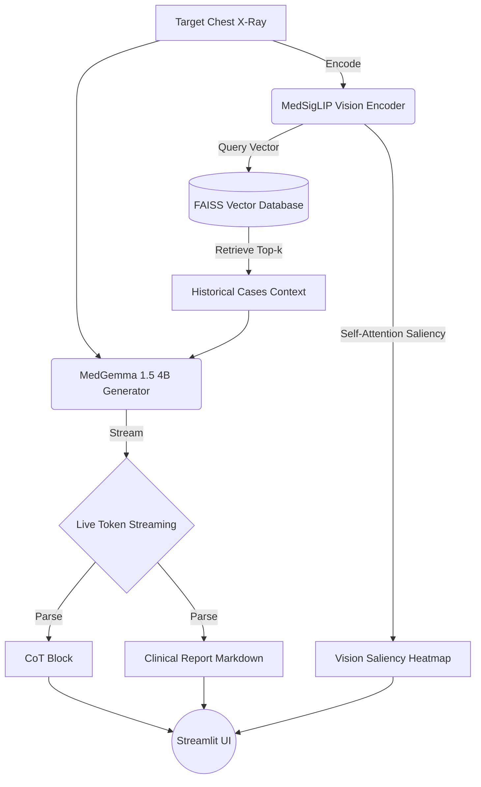

# CLIN-RAG: Clinical Evidence Retrieval and Grounded Report Generation

[](https://www.python.org/downloads/)
[](https://pytorch.org/)
[](https://huggingface.co/)
[](https://streamlit.io/)

**Subtitle:** Master's Thesis Project by **Oliver Tano Schlichting** (HAW Hamburg)  
**Thesis Title:** *Example-Based Explainability in Clinical Vision-Language Models: A Precedence-Driven Retrieval-Augmented Generation Approach*

---

## Project Overview

CLIN-RAG is a state-of-the-art multimodal Retrieval-Augmented Generation (RAG) system designed for automated chest X-ray report generation. The system aims to bridge the "Semantic Gap" in medical imaging by employing a precedence-driven RAG architecture. 

By retrieving structurally and semantically similar historical cases to ground the Large Language Model (LLM), CLIN-RAG minimizes hallucinations. Furthermore, it provides interpretability via a strict "Clinical Chain of Thought" (CoT) and Vision Tower Self-Attention heatmaps.

### Core Technologies
- **Vision Encoder:** MedSigLIP (`google/medsiglip-448`)
- **Vector Database:** FAISS (Inner-Product Indexing)
- **Generator:** MedGemma-1.5-4B-IT (`google/medgemma-1.5-4b-it`)

---

## Architecture



---

## Features

- **Precedence-Driven RAG:** Retrieves structurally similar historical cases to provide highly relevant medical context and ground the LLM's diagnosis.
- **Clinical Chain of Thought (CoT):** Enforces internal reasoning prior to diagnosis generation, reducing hallucinations by requiring visual facts to be stated first.
- **Explainable AI (XAI):** Extracts the final-layer self-attention maps directly from the MedSigLIP Vision Encoder to visualize the model's structural focus and general visual saliency during image processing.
- **Live Token Streaming:** Real-time UI rendering in Streamlit with on-the-fly Regex parsing of reasoning blocks and report sections.
- **Ablation Evaluation Suite:** Automated offline evaluation calculating standard NLP metrics (ROUGE, BLEU, BERTScore) and domain-specific metrics (Clinical Recall).

---

## Installation & Setup

1. **Clone the Repository**
   ```bash
   git clone <repository-url>
   cd CLIN-RAG
   ```

2. **Create a Virtual Environment**
   ```bash
   python -m venv .venv
   source .venv/bin/activate  # On Windows: .venv\Scripts\activate
   ```

3. **Install Dependencies**
   ```bash
   pip install -r requirements.txt
   ```

4. **Hugging Face Authentication**
   The project requires access to gated models (e.g., MedGemma). You must place your Hugging Face access token in the following file:
   `data/Hugging_Face_Access_Token.txt`

---

## Usage Guide

### Streamlit UI (Interactive Demo)
To launch the interactive web interface, run:
```bash
streamlit run app.py
```
- **Live Analysis:** Upload a chest X-ray and click "Generate Clinical Report".
- **Test Mode:** Use the sidebar checkbox to load predefined test cases for qualitative evaluation without manually uploading images.

### Quantitative Evaluation
To run the ablation evaluation suite (comparing the Baseline model vs. the RAG model):
```bash
python evaluation/evaluate_pipeline.py
```
- Use the `--debug` flag to run a quick test on only 2 samples.
- The script automatically generates qualitative CSVs, LaTeX summary tables, and statistical distribution plots in the `evaluation_runs/` directory.

---

## Using Custom Datasets (Bring Your Own Data)

CLIN-RAG is designed to be easily adaptable to your own hospital's historical dataset. Follow these strict structural requirements to deploy CLIN-RAG with custom data:

### 1. Data Structure
Place your raw/normalized X-ray images in:
`data/archive/images/images_normalized/`

Provide a metadata CSV file at:
`data/archive/indiana_reports.csv`

The CSV **must** contain the following columns:
- `uid`: Unique identifier for the case (integer).
- `filename`: Exact filename of the associated image in the images directory.
- `projection`: The X-ray projection (e.g., "Frontal", "Lateral").
- `findings`: The ground truth radiological findings text.
- `impression`: The ground truth radiological impression text.

### 2. Prepare the FAISS Index & Entities
Before running the Streamlit app with your new data, you must regenerate the system's vector database and entity lists:

1. **Extract Clinical Entities:**
   Generates the JSON file used for Clinical Recall metric evaluation.
   ```bash
   python scripts/extract_clinical_entities.py
   ```

2. **Build FAISS Index:**
   Encodes your entire image dataset using MedSigLIP and constructs the high-speed FAISS vector database.
   ```bash
   python scripts/build_index.py
   ```

Once these scripts complete successfully, you can run `streamlit run app.py` to use CLIN-RAG with your custom data!
